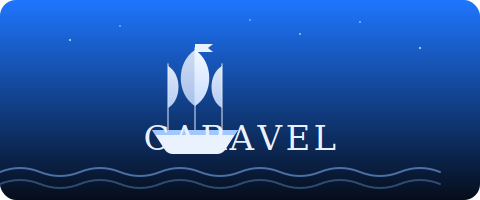

<p align="center">
  
</p>

<p align="center"><b>A self-hosted, provider-agnostic staff of named agents — running on your own coding subscription.</b></p>

Caravel turns your coding-agent CLI into a personal, always-on crew. It runs as a background daemon: a coordinator triages what you throw at it, hands work to named specialist agents, and consolidates their results. It executes tasks on a schedule, answers on Telegram and Discord, transcribes voice, and gives you a live web dashboard over the whole fleet — all folder-isolated on your own machine, with no API overhead.

> **Forked from [ClaudeClaw](https://github.com/moazbuilds/claudeclaw) by [moazbuilds](https://github.com/moazbuilds)** — MIT licensed. Caravel keeps the upstream always-on-daemon foundation and adds a multi-agent orchestration layer (named roster, task envelopes, a coordinator, provider routing) on top. See [`LICENSE`](LICENSE) for the upstream copyright and attribution.

> Note: Please use Caravel responsibly. Don't point it at systems you don't own or aren't authorised to operate.

## Why Caravel?

| Category | Caravel |
| --- | --- |
| Model provider | Provider-agnostic — routes to Claude Code and other backends (GLM, OpenRouter, …) |
| What you run | A **roster of named agents** (a coordinator + specialists), not a single assistant |
| Orchestration | Task envelopes with `open → claimed → done/failed/waiting` lifecycle, leases, continuations |
| API overhead | Runs directly on your existing coding subscription |
| Isolation | Folder-based per-agent isolation (identity, rules, memory on disk) |
| Deployment | Clone-and-run, or install as a plugin; any device or VPS |
| Interfaces | Web dashboard, Telegram, Discord, voice |

## Run from source (clone and run)

```bash
git clone https://github.com/caravelhq/caravel.git
cd caravel
bun install
bun run start --web        # starts the daemon + web dashboard on http://127.0.0.1:4632
```

All configuration and secrets live in `.caravel/settings.json` (Telegram/Discord tokens, model selection, security level, web host/port). That directory is gitignored — nothing sensitive is ever committed. The first `start` writes a default settings file you can edit.

> **Existing ClaudeClaw installs:** if you already have a `.claude/claudeclaw/` directory, Caravel detects it automatically and keeps using it — no manual migration needed. New installs land in `.caravel/`. To migrate an existing install, `mv .claude/claudeclaw .caravel`.

Requirements: [Bun](https://bun.sh) and the [Claude Code CLI](https://claude.ai/download) (`claude`) on your PATH. Caravel spawns workers as `claude -p ...` subprocesses — the Claude Code CLI is required; alternative agent CLIs are not tested or supported.

## Install as a plugin *(optional, future)*

```bash
claude plugin marketplace add caravelhq/caravel
claude plugin install caravel
```

The plugin install is an alternative deployment path — it is not required for the multi-agent workflow. Running from source (above) is the primary, tested path. The plugin may not yet be available in all regions.

> Migrating from a ClaudeClaw install? The command namespace moves from `/claudeclaw:*` to `/caravel:*` on reinstall. Keep the old plugin installed alongside during transition if you rely on the old commands.

## Remote access via Tailscale

The dashboard binds to `http://127.0.0.1:4632` by default — localhost only. To access it from your phone, tablet, or any other machine on your [Tailscale](https://tailscale.com) network:

```bash
# 1. Allow your user to manage Tailscale without sudo (Linux — run once):
sudo tailscale set --operator=$USER

# 2. Expose the dashboard via Tailscale (run once, persists across reboots):
tailscale serve http://127.0.0.1:4632
```

The dashboard is then available at `https://<machine-name>.<tailnet>.ts.net` from every device on your tailnet. Tailscale handles HTTPS automatically — no cert setup required.

> **macOS / Windows:** the `--operator` step is not needed. Start from step 2.

**Auto-connect before the daemon starts.** If you need Tailscale to reconnect on reboot before workers can reach the network, uncomment this line in your workspace `restart-caravel.sh`:

```bash
export CARAVEL_PRESTART_HOOK="tailscale up"
```

The pre-start hook runs once, before the daemon starts, every time you call `restart-caravel.sh`.

## Multi-agent mode

This is Caravel's headline feature. Instead of one assistant, you define a roster of agents — each with its own identity, rules, and memory — and dispatch work to them as tasks. A coordinator agent triages requests, hands tasks to specialists, and consolidates the results. The dashboard shows every agent's queue, and tasks flow through `open → claimed → done/failed/waiting` buckets on disk.

### How it works

- **Agents live on disk.** Each agent is a directory at `agents/<name>/` containing `agent.json` (manifest: name, display name, emoji, description) and `CLAUDE.md` (its identity prompt). Optional `rules/*.md` and `memory/` are picked up automatically. The roster is derived from this directory — add an agent and it appears everywhere (runner, dashboard, task picker) with no code changes.
- **Tasks are YAML envelopes.** Each agent has `tasks/{open,done,failed,waiting}/` and an append-only `journal.ndjson`. The runner claims open tasks, spawns the agent to work them, and moves the file as the status changes.
- **The coordinator** (named `alice` by default) receives consolidated continuations when a family of dispatched sub-tasks completes. Keep one coordinator in your roster.

### Set it up

```bash
# from your project root (the directory the daemon runs in)
CARAVEL_PROJECT_DIR="$PWD" \
CARAVEL_REPO_DIR="/path/to/caravel" \
CARAVEL_AGENTS="alice bob ray" \
  bash /path/to/caravel/scripts/install-multi-agent.sh
```

This scaffolds the `/task` skill, the shared task-envelope spec, and per-agent `tasks/` directories. For any agent name that doesn't already have a profile, it seeds an example one (coordinator / builder / researcher) from `multi-agent/template/agents/` so you start with a runnable roster. Edit those profiles — or add your own under `agents/<name>/` — to define your team. Enable the runner with `CARAVEL_MULTI_AGENT_RUNNER=1`.

See [`multi-agent/README.md`](multi-agent/README.md) for the full task-envelope schema and dispatch model.

## Features

### Automation
- **Heartbeat:** Periodic check-ins with configurable intervals, quiet hours, and editable prompts.
- **Cron Jobs:** Timezone-aware schedules for repeating or one-time tasks with reliable execution.

### Communication
- **Telegram:** Text, image, and voice support.
- **Discord:** DMs, server mentions/replies, slash commands, voice messages, and image attachments.
- **Time Awareness:** Message time prefixes help agents understand delays and daily patterns.

### Multi-Session Threads (Discord)
- **Independent Thread Sessions:** Each Discord thread gets its own CLI session, fully isolated from the main channel.
- **Parallel Processing:** Thread conversations run concurrently — messages in different threads don't block each other.
- **Auto-Create:** First message in a new thread automatically bootstraps a fresh session.
- **Session Cleanup:** Thread sessions are cleaned up when threads are deleted or archived.
- **Backward Compatible:** DMs and main channel messages continue using the global session.

See [docs/MULTI_SESSION.md](docs/MULTI_SESSION.md) for technical details.

### Reliability and Control
- **Provider Fallback:** Automatically continue on an alternate provider if your primary limit is reached.
- **Web Dashboard:** Manage jobs, monitor runs, watch the agent fleet, and inspect logs in real time.
- **Security Levels:** Four access levels from read-only to full system access.
- **Model Selection:** Switch models based on your workload.

## Attribution

Caravel is a fork of **[ClaudeClaw](https://github.com/moazbuilds/claudeclaw)** by **moazbuilds**, distributed under the MIT License. The upstream copyright notice is retained in [`LICENSE`](LICENSE). The multi-agent orchestration layer, provider routing, and the Caravel branding are additions made in this fork.
